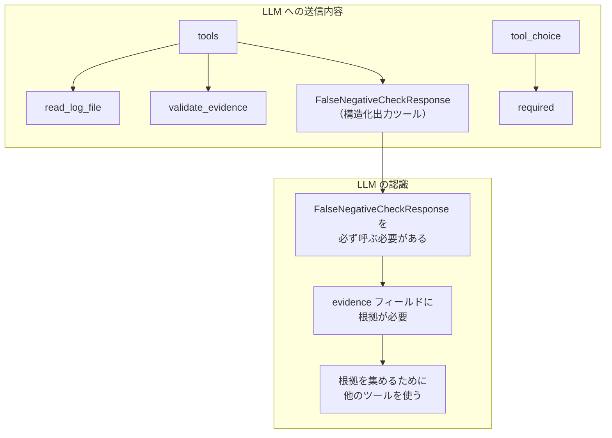
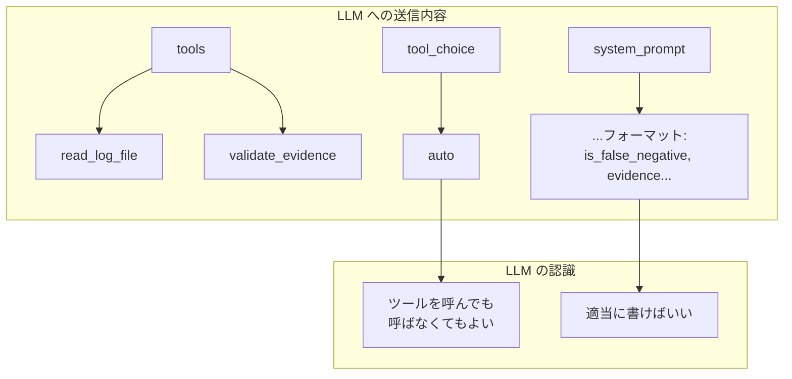
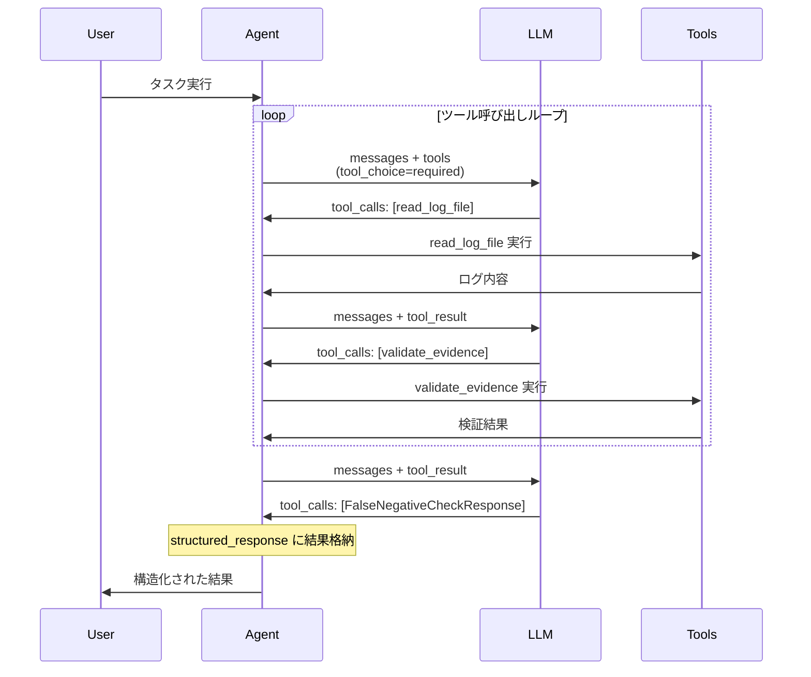
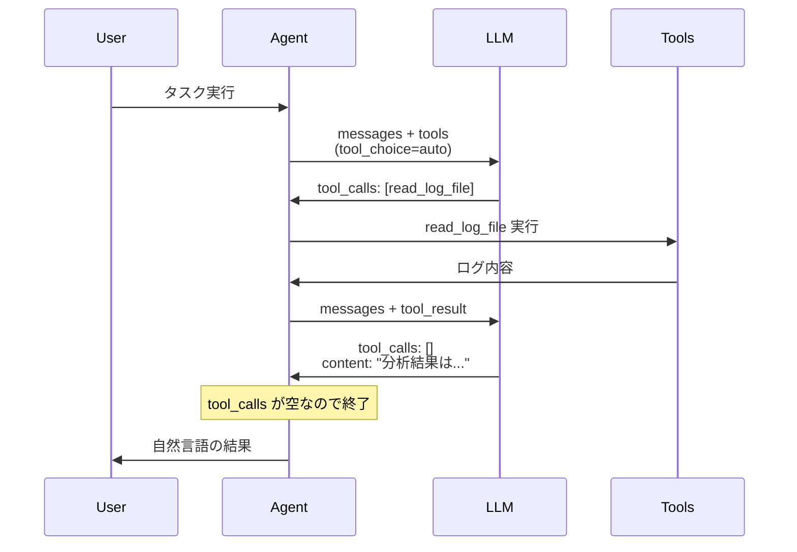

# LangChain v1 `create_agent` の `response_format` 引数がエージェント動作に与える影響

## 概要

LangChain v1 の `create_agent` 関数において、`response_format` 引数を指定した場合と指定しない場合で、エージェントの動作が大きく異なることが確認されました。

特に顕著な違いとして、**`response_format` を指定してエビデンスフィールドを含むスキーマを設定すると、LLM が validate 関連のツールを積極的に呼び出すようになる**という挙動が観察されています。

### 検証結果サマリー

| 設定 | validate 呼び出し率 |
|------|---------------------|
| `response_format` + validation_result フィールド | **100%** |
| `response_format` なし | **40%** |

※ ProviderStrategy と ToolStrategy に差はなし（両方 100%）

本ドキュメントでは、この挙動の技術的な原因を詳細に解説します。

---

## 調査対象コード

### LangChain ライブラリ

- `langchain/agents/factory.py` - エージェント作成のメインファクトリ
- `langchain/agents/structured_output.py` - 構造化出力の型定義
- `langchain_openai/chat_models/base.py` - OpenAI チャットモデル
- `langchain_core/utils/function_calling.py` - ツール変換ユーティリティ

### smartestiroid プロジェクト

- `smartestiroid/agents/dialog_agent.py` - ダイアログ処理エージェント
- `smartestiroid/agents/step_executor.py` - ステップ実行エージェント
- `smartestiroid/utils/analysis_agent.py` - 失敗分析エージェント
- `smartestiroid/utils/false_positive_negative_analyzer.py` - 偽陽性/偽陰性分析
- `smartestiroid/analysis_agents/base_agent.py` - 探索型エージェント基底クラス

---

## 1. `response_format` の3つの戦略

`create_agent` の `response_format` 引数には以下の戦略が指定可能です：

```python: langchain/agents/structured_output.py:181-246
@dataclass(init=False)
class ToolStrategy(Generic[SchemaT]):
    """Use a tool calling strategy for model responses."""

    schema: type[SchemaT]
    """Schema for the tool calls."""

    schema_specs: list[_SchemaSpec[SchemaT]]
    """Schema specs for the tool calls."""

    tool_message_content: str | None
    """The content of the tool message to be returned when the model calls
    an artificial structured output tool."""

    handle_errors: (
        bool | str | type[Exception] | tuple[type[Exception], ...] | Callable[[Exception], str]
    )
    """Error handling strategy for structured output via `ToolStrategy`."""


@dataclass(init=False)
class ProviderStrategy(Generic[SchemaT]):
    """Use the model provider's native structured output method."""

    schema: type[SchemaT]
    """Schema for native mode."""

    schema_spec: _SchemaSpec[SchemaT]
    """Schema spec for native mode."""
```

```python: langchain/agents/structured_output.py:429-444
class AutoStrategy(Generic[SchemaT]):
    """Automatically select the best strategy for structured output."""

    schema: type[SchemaT]
    """Schema for automatic mode."""

    def __init__(
        self,
        schema: type[SchemaT],
    ) -> None:
        """Initialize AutoStrategy with schema."""
        self.schema = schema


ResponseFormat = ToolStrategy[SchemaT] | ProviderStrategy[SchemaT] | AutoStrategy[SchemaT]
```

| 戦略 | 説明 | 使用ケース |
|------|------|-----------|
| `None` | 構造化出力なし。ツール呼び出しがなくなるまでループ | 自由探索（ReAct パターン） |
| `ToolStrategy` | スキーマをツールとして登録し、呼び出させて終了 | 構造化出力が必要な場合 |
| `ProviderStrategy` | OpenAI の native JSON mode を使用 | 高精度な構造化出力 |
| `AutoStrategy` | モデル能力に応じて自動選択 (gpt-4o系はProviderStrategy) | Pydantic モデルを直接渡した場合 |

---

## 2. 動作の違いの原因

### 2.1 構造化出力スキーマがツール定義として送信される

`response_format` を指定すると、Pydantic モデルが**ツールとして**LLM に送信されます。

```python: langchain/agents/factory.py:720-729
    if isinstance(initial_response_format, AutoStrategy):
        tool_strategy_for_setup = ToolStrategy(schema=initial_response_format.schema)
    elif isinstance(initial_response_format, ToolStrategy):
        tool_strategy_for_setup = initial_response_format

    structured_output_tools: dict[str, OutputToolBinding] = {}
    if tool_strategy_for_setup:
        for response_schema in tool_strategy_for_setup.schema_specs:
            structured_tool_info = OutputToolBinding.from_schema_spec(response_schema)
            structured_output_tools[structured_tool_info.tool.name] = structured_tool_info
```

ツール変換処理：

```python: langchain/agents/structured_output.py:306-322
    @classmethod
    def from_schema_spec(cls, schema_spec: _SchemaSpec[SchemaT]) -> Self:
        """Create an `OutputToolBinding` instance from a `SchemaSpec`.

        Args:
            schema_spec: The `SchemaSpec` to convert

        Returns:
            An `OutputToolBinding` instance with the appropriate tool created
        """
        return cls(
            schema=schema_spec.schema,
            schema_kind=schema_spec.schema_kind,
            tool=StructuredTool(
                args_schema=schema_spec.json_schema,
                name=schema_spec.name,
                description=schema_spec.description,
            ),
        )
```

### 2.2 `tool_choice="required"` の強制

`response_format` を指定すると、`tool_choice` が `"any"`（OpenAI API では `"required"` に変換）に強制されます。

```python: langchain/agents/factory.py:1055-1074
        if isinstance(effective_response_format, ToolStrategy):
            # Current implementation requires that tools used for structured output
            # have to be declared upfront when creating the agent as part of the
            # response format. Middleware is allowed to change the response format
            # to a subset of the original structured tools when using ToolStrategy,
            # but not to add new structured tools that weren't declared upfront.
            # Compute output binding
            for tc in effective_response_format.schema_specs:
                if tc.name not in structured_output_tools:
                    msg = (
                        f"ToolStrategy specifies tool '{tc.name}' "
                        "which wasn't declared in the original "
                        "response format when creating the agent."
                    )
                    raise ValueError(msg)

            # Force tool use if we have structured output tools
            tool_choice = "any" if structured_output_tools else request.tool_choice
            return (
                request.model.bind_tools(
                    final_tools, tool_choice=tool_choice, **request.model_settings
                ),
                effective_response_format,
            )
```

OpenAI API への変換：

```python: langchain_openai/chat_models/base.py:1875-1882
                # 'any' is not natively supported by OpenAI API.
                # We support 'any' since other models use this instead of 'required'.
                elif tool_choice == "any":
                    tool_choice = "required"
                else:
                    pass
            elif isinstance(tool_choice, bool):
                tool_choice = "required"
```

### 2.3 終了条件の違い

#### `response_format` なしの場合

```python: langchain/agents/factory.py:1537-1540
        # 2. if the model hasn't called any tools, exit the loop
        # this is the classic exit condition for an agent loop
        if len(last_ai_message.tool_calls) == 0:
            return end_destination
```

**終了条件**: LLM が `tool_calls` を返さなくなったら終了

#### `response_format` ありの場合

```python: langchain/agents/factory.py:1562-1564
        # 4. if there is a structured response, exit the loop
        if "structured_response" in state:
            return end_destination
```

**終了条件**: 構造化出力ツールを呼び出したら終了

---

## 3. スキーマの JSON Schema 変換

Pydantic モデルは JSON Schema に変換され、ツール定義として LLM に送信されます。

### 例: `FalseNegativeCheckResponse`

```python: smartestiroid/utils/false_positive_negative_analyzer.py:68-82
class FalseNegativeCheckResponse(BaseModel):
    """偽陰性チェックのエージェント出力"""
    
    is_false_negative: bool = Field(description="偽陰性かどうか（本当はPASSすべきか）")
    confidence: float = Field(description="判定の確信度 0.0-1.0", ge=0.0, le=1.0)
    evidence: List[str] = Field(description="判定の根拠となる証拠リスト")
    expected_result_analysis: str = Field(description="期待結果と実際の結果の比較分析")
    step_execution_analysis: str = Field(description="ステップ実行状況の分析")
    screenshot_analysis: Optional[str] = Field(default=None, description="スクリーンショット分析結果")
    misclassification_cause: Optional[str] = Field(
        default=None,
        description="誤分類の原因: smartestiroid_bug, spec_issue, app_behavior, temporary_error"
    )
    cause_details: Optional[str] = Field(default=None, description="原因の詳細説明")
    recommendations: List[str] = Field(description="対処の推奨事項")
```

変換後の JSON Schema（OpenAI ツール形式）：

```json
{
  "type": "function",
  "function": {
    "name": "FalseNegativeCheckResponse",
    "description": "偽陰性チェックのエージェント出力",
    "parameters": {
      "type": "object",
      "properties": {
        "is_false_negative": {
          "type": "boolean",
          "description": "偽陰性かどうか（本当はPASSすべきか）"
        },
        "confidence": {
          "type": "number",
          "minimum": 0.0,
          "maximum": 1.0,
          "description": "判定の確信度 0.0-1.0"
        },
        "evidence": {
          "type": "array",
          "items": {"type": "string"},
          "description": "判定の根拠となる証拠リスト"
        }
      },
      "required": ["is_false_negative", "confidence", "evidence", ...]
    }
  }
}
```

---

## 4. LLM に送信される情報の比較

### `response_format` ありの場合



### `response_format` なしの場合



---

## 5. エージェントループの違い

### `response_format` ありの場合



### `response_format` なしの場合



---

## 6. smartestiroid での使用パターン

### パターン1: 構造化出力あり（ToolStrategy）

```python: smartestiroid/agents/dialog_agent.py:285-290
        # エージェントを作成（構造化出力付き）
        self.agent = create_agent(
            self.llm,
            _dialog_tools(),
            system_prompt=DIALOG_SYSTEM_PROMPT,
            response_format=ToolStrategy(DialogResult),  # ★構造化出力
        )
```

結果の取得：

```python: smartestiroid/agents/dialog_agent.py:357-359
        # 構造化出力を取得
        # response_format 使用時は "structured_response" キーに結果が格納される
        structured_response: DialogResult = result["structured_response"]
```

### パターン2: 構造化出力なし（ReAct パターン）

```python: smartestiroid/analysis_agents/base_agent.py:256-266
    def _setup_exploration_agent(self):
        """探索用エージェントを初期化（LangChain v1）
        
        response_format なしで作成し、自由に探索できるようにする。
        """
        self.exploration_agent = create_agent(
            self.llm,
            self._tools,
            system_prompt=self.get_system_prompt(),
            # response_format なし → ReActパターンで自由に探索
        )
```

---

## 7. 挙動の違いの技術的メカニズム

### evidence フィールドのスキーマ効果

`response_format` で `evidence: List[str]` フィールドを持つスキーマを指定すると：

1. **型情報の明示**: `"type": "array", "items": {"type": "string"}` として送信
2. **description の効果**: 「判定の根拠となる証拠リスト」がツール引数の説明として送信
3. **required 制約**: 必須フィールドとしてマーク

LLM はこれを見て：
- 「`evidence` は配列である（空ではいけない）」と理解
- 「根拠となる**証拠**を複数提供する必要がある」と判断
- 「証拠を集めるためにツールを使う必要がある」と推論

### プロンプトのみの場合

```
出力フォーマット:
- is_false_negative: true/false
- confidence: 0.0-1.0
- evidence: 判定の根拠
```

この場合、LLM は：
- テキスト形式の指示として認識
- 強制力がない
- 「適当に書けばいい」と判断しがち

---

## 8. 比較表

| 項目 | `response_format` あり | `response_format` なし |
|------|------------------------|------------------------|
| ツール定義 | 通常ツール + 構造化出力ツール | 通常ツールのみ |
| tool_choice | `"required"` | `"auto"` |
| 終了条件 | 構造化出力ツールを呼んだら | tool_calls が空になったら |
| evidence の扱い | JSON Schema の必須フィールド | プロンプトのテキスト指示 |
| validate ツール呼び出し | **積極的** | 消極的 |
| 情報収集の徹底度 | 高い | 低い |
| ループ回数 | 多い（情報収集継続） | 少ない（早期終了） |
| evidence の質 | 具体的（ツール結果引用） | 曖昧（推測含む） |

---

## 9. 検証実験

上記の技術的分析が正しいかを検証するため、実際にテストプログラムを作成して実験を行いました。

### 9.1 検証プログラムの構成

検証プログラムは以下の2ファイルで構成されています：

- `main.py` - テスト実行とレポート出力
- `util.py` - ツール定義、スキーマ、テストケース

### 9.2 検証用ツール

四則演算ツールと検証ツールを用意しました：

```python
@tool
def add(a: float, b: float) -> float:
    """2つの数値を加算します。"""
    tracker.record("add")
    return a + b

@tool
def subtract(a: float, b: float) -> float:
    """2つの数値を減算します (a - b)。"""
    tracker.record("subtract")
    return a - b

@tool
def multiply(a: float, b: float) -> float:
    """2つの数値を乗算します。"""
    tracker.record("multiply")
    return a * b

@tool
def divide(a: float, b: float) -> float:
    """2つの数値を除算します (a / b)。"""
    tracker.record("divide")
    return a / b

@tool
def validate_calculation(expected: float, actual: float, operation: str) -> dict:
    """計算結果を検証します。"""
    tracker.record("validate_calculation")
    is_correct = abs(expected - actual) < 1e-6
    return {"operation": operation, "is_correct": is_correct}
```

ツール呼び出しをカウントするため、`ToolCallTracker` クラスを使用しています。

### 9.3 検証用スキーマ

`validation_result` フィールドを含むスキーマを定義しました：

```python
class SchemaWithValidation(BaseModel):
    """validation_result フィールドを含むスキーマ"""
    final_answer: float = Field(description="最終的な計算結果")
    validation_result: dict | None = Field(
        default=None, description="validate_calculation の結果"
    )
    reasoning: str = Field(description="計算プロセスの説明")
```

### 9.4 テストケース

暗算が困難な複雑な四則演算タスクを10個用意しました。**タスクには「検証してください」という指示を含めず**、スキーマの影響のみを測定します：

```python
TEST_CASES = [
    TestCase("calc_01", "(17 × 23) + (89 ÷ 4) - 156 を計算してください。"),     # 257.25
    TestCase("calc_02", "(1024 ÷ 16) × 7 - (33 + 45) を計算してください。"),    # 370
    TestCase("calc_03", "(999 - 123) × 2 ÷ 4 + 67 を計算してください。"),       # 505
    TestCase("calc_04", "(48 + 72) × 5 - (200 ÷ 8) を計算してください。"),      # 575
    TestCase("calc_05", "(144 ÷ 12) + (35 × 6) - 89 を計算してください。"),     # 133
    TestCase("calc_06", "(500 - 123) × 3 ÷ 9 + 44 を計算してください。"),       # 169.67
    TestCase("calc_07", "(81 ÷ 9) × (14 + 6) - 55 を計算してください。"),       # 125
    TestCase("calc_08", "(256 + 128) ÷ 4 × 3 - 100 を計算してください。"),      # 188
    TestCase("calc_09", "(77 × 11) - (324 ÷ 18) + 29 を計算してください。"),    # 858
    TestCase("calc_10", "(1000 - 450) ÷ 5 + (32 × 4) を計算してください。"),    # 238
]
```

### 9.5 システムプロンプト

公平な比較のため、以下のプロンプトを使用しました：

**response_format あり (ToolStrategy / ProviderStrategy) の場合:**
```
あなたは計算を実行するアシスタントです。

【ルール】
1. 計算は必ず add, subtract, multiply, divide ツールを使用
2. 暗算禁止。必ずツールを呼ぶこと
3. ステップごとにツールを呼び出すこと
```

**response_format なしの場合:**
```
あなたは計算を実行するアシスタントです。

【ルール】
1. 計算は必ず add, subtract, multiply, divide ツールを使用
2. 暗算禁止。必ずツールを呼ぶこと
3. ステップごとにツールを呼び出すこと

【出力形式】
最終回答はJSON形式で:
{"final_answer": <数値>, "reasoning": "<説明>"}
```

**注意**: `no_format` のプロンプトには `validation_result` フィールドを含めていません。これにより、response_format によるスキーマの効果のみを測定できます。

### 9.6 テスト実行コード

```python
def run_test(mode: Mode, schema_type: SchemaType | None, task: str) -> TestResult:
    """単一テストを実行"""
    tracker.reset()
    
    llm = get_llm()
    prompt = SYSTEM_PROMPT_NO_FORMAT_SIMPLE if mode == "no_format" else SYSTEM_PROMPT
    
    agent = create_agent(
        llm, ALL_TOOLS,
        response_format=get_response_format(mode, schema_type),
        system_prompt=prompt,
    )
    agent.invoke({"messages": [("user", task)]})
    return TestResult(mode, schema_type, tracker.count("validate_calculation"), True)
```

### 9.7 テスト設定

3つの設定で比較しました：

| 設定 | response_format | スキーマ |
|------|-----------------|----------|
| `no_format` | None | なし |
| `tool_strategy` | ToolStrategy | SchemaWithValidation |
| `provider_strategy` | ProviderStrategy | SchemaWithValidation |

### 9.8 検証結果

10個のテストケース × 3設定 = 30回のテストを実行した結果：

| 設定 | validate 呼び出し | 平均 |
|------|------------------|------|
| `provider_strategy` (with_validation) | [1,1,1,1,1,1,1,1,1,1] | **1.0回** |
| `tool_strategy` (with_validation) | [1,1,1,1,1,1,1,1,1,1] | **1.0回** |
| `no_format` (スキーマなし) | [0,0,1,0,1,0,0,1,0,1] | **0.4回** |

---

## 10. 結論

### 確認された主張

1. **スキーマの明示性**: `validation_result` フィールドが**型付きのフィールド**として定義されると、LLM はそのフィールドを埋めるために validate ツールを呼ぶ

2. **response_format の効果**: `response_format` を指定すると validate が **100%** 呼ばれる。指定しないと **40%** 程度

3. **終了条件の変化**: 構造化レスポンスが返されるまでループが継続する

### 確認できなかった主張

当初の仮説では「ProviderStrategy は Optional フィールドでも埋めようとするが、ToolStrategy は省略可能」と考えられていましたが、

実験の結果、**ProviderStrategy と ToolStrategy に差はありませんでした**：

- 両方とも `validation_result` フィールドがあると **100%** validate を呼ぶ
- 重要なのは**ストラテジーの種類ではなく、スキーマにフィールドが定義されているかどうか**

---

## 11. 推奨事項

### 構造化出力が必要で、情報収集を徹底させたい場合

```python
from langchain.agents import create_agent
from langchain.agents.structured_output import ToolStrategy, ProviderStrategy

# ToolStrategy でも ProviderStrategy でも効果は同等
agent = create_agent(
    model,
    tools,
    system_prompt=system_prompt,
    response_format=ToolStrategy(MyOutputSchema),  # または ProviderStrategy
)
```

### 自由探索が必要で、LLM に終了タイミングを任せたい場合

```python
from langchain.agents import create_agent

agent = create_agent(
    model,
    tools,
    system_prompt=system_prompt,
    # response_format なし → ReAct パターン
)
```

### evidence フィールドの設計指針

```python
from pydantic import BaseModel, Field
from typing import List

class MyAnalysisResult(BaseModel):
    """分析結果（docstring がツールの description になる）"""
    
    # 具体的な description を書くと、LLM がそれを埋めるために
    # 他のツールを使って情報収集する
    evidence: List[str] = Field(
        description="判定の根拠となる具体的な証拠。"
                    "ログファイルからの引用や検証結果を含むこと。"
    )
```

---

## 参考資料

- [LangChain Agents Documentation](https://docs.langchain.com/oss/python/langchain/agents)
- [OpenAI Function Calling](https://platform.openai.com/docs/guides/function-calling)
- [OpenAI Structured Outputs](https://platform.openai.com/docs/guides/structured-outputs)
